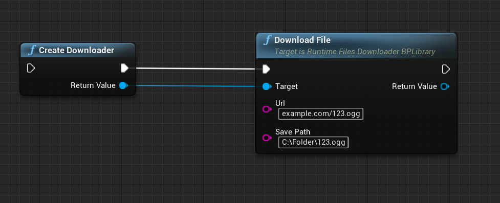
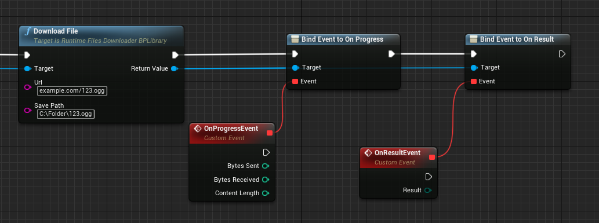

# RuntimeFilesDownloader
This plugin will be useful for those who want to be able to download any files via HTTP protocol on runtime and save in device storage. It's easy to use in both C++ and Blueprints.

## Features
- Low library size (≈ 30 kb)
- Fast downloading speed (780 kb file - 28 sec to download - 4.7 Mbps network speed)
- No any third party libraries and external dependencies
- Support for all available devices (tested on Windows and Android, but there are no restrictions to work on other devices)

## How to install
There're two ways to install the plugin:
1) [Through the marketplace (not ready yet)](https://www.unrealengine.com/marketplace/product/runtime-files-downloader).
2) Manual installation. Just extract the "RuntimeFilesDownloader" folder into your plugins project folder to get the following path: "[ProjectName]/Plugins/RuntimeFilesDownloader".

## How to use
 There are two ways to use this plugin: using Blueprints and C++:
 1. Blueprints. Just reopen your Unreal project and use "Create Downloader" and "Download File" nodes.
 2. C++. Open your "[ProjectName].Build.cs" and find a block of ` PublicDependencyModuleNames ` or ` PrivateDependencyModuleNames ` (it depends on your needs). Add `"RuntimeFilesDownloader"` String inside this block. After just include "RuntimeAudioImporterBPLibrary.h" using ` #include "RuntimeFilesDownloaderBPLibrary.h" ` where needed.

## Legal info

Unreal® is a trademark or registered trademark of Epic Games, Inc. in the United States of America and elsewhere.

Unreal® Engine, Copyright 1998 – 2020, Epic Games, Inc. All rights reserved.
